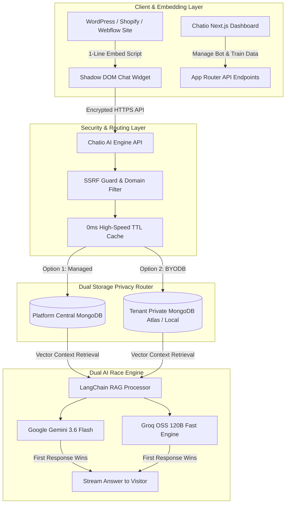

# 🤖 Chatio by Anza — Universal Custom RAG AI Chatbot & Customer Support Platform

<div align="center">


-black?style=for-the-badge&logo=next.js)


<p align="center">
  <b>A 100% Free, Open-Source, Enterprise-Grade Self-Hosted Custom AI Chatbot Platform powered by Retrieval-Augmented Generation (RAG), Dual AI Speed Engine (Google Gemini × Groq), Dual Database Privacy Architecture (Managed vs BYODB), and Zero-Conflict Shadow DOM Embed Technology.</b>
</p>

---

[Key Features](#-key-features--business-benefits) •
[Dual Storage Architecture](#-dual-database-storage--privacy-architecture) •
[Data Formats](#-supported-knowledge-base-formats) •
[API Keys Guide](#-step-by-step-api-keys-acquisition-guide) •
[Local Setup](#-local-development--setup-guide) •
[Server Deployment](#-production--server-deployment-guide) •
[Embed Snippets](#-universal-1-line-embed-snippets) •
[System Architecture](#-system-architecture)

</div>

---

## 👨‍💻 Product Identity & Author Credits

- **Product Name**: **Chatio** (`Chatio by Anza`)
- **Author & Lead Architect**: **Muhammad Anza Muneeb Khan**
- **Repository**: [github.com/anzamuneebkhanofficial/chatio](https://github.com/anzamuneebkhanofficial/chatio)
- **License**: 100% Free & Open Source (MIT License)

---

## 💡 What is Chatio by Anza?

**Chatio by Anza** is a complete, multi-tenant SaaS platform that allows store owners, bloggers, enterprise businesses, and developers to instantly train custom AI chatbots on their own private data and embed them into **ANY website in under 60 seconds**.

### 🛑 The Problem Chatio Solves
Commercial AI chatbot SaaS platforms charge **$50 to $500/month** with strict message limits, retain your customer data on proprietary cloud servers, and cause CSS conflicts when embedded on WordPress or Shopify sites.

### 🌟 The Chatio Solution
**Chatio is 100% free, open-source, and self-hostable**. You retain complete sovereignty over your data, your API keys, and your widget branding with **zero monthly subscription fees**.

---

## ⚡ Key Features & Business Benefits

### 💼 For Business Owners & Store Managers
* **24/7 Automated Support & Lead Capture**: Instantly answer customer questions, recommend products, and resolve inquiries round the clock without hiring extra support staff.
* **$0 Monthly SaaS Costs**: Operate an enterprise-grade AI chatbot infrastructure using free-tier API quotas from Google Gemini, Groq, and MongoDB Atlas.
* **Zero CSS Conflict / Style Pollution**: Embeds using **Shadow DOM (`attachShadow({ mode: 'open' })`)**, guaranteeing that customer site CSS never messes up the chatbot widget, and chatbot CSS never breaks the host website.
* **Global Multi-Platform Compatibility**: Embed effortlessly on **WordPress, Shopify, Webflow, Squarespace, Wix, custom React/Next.js apps, or plain HTML sites** across any region or domain.

### 🛠️ For Developers & Engineers
* **RAG Architecture with LangChain**: Automatic semantic text chunking (`RecursiveCharacterTextSplitter`), metadata indexing, and vector similarity search.
* **Dual AI Race Engine (Gemini 3.6 Flash × Groq)**: Calls **Google Gemini 3.6 Flash** and **Groq (`openai/gpt-oss-120b`)** simultaneously. The fastest response wins, providing sub-second answers and seamless failover.
* **Dual Database Privacy Engine (Managed vs BYODB)**: Choose between Managed Cloud with AES-256-GCM encryption or Bring Your Own Database (BYODB) for 100% private database isolation.
* **High-Speed TTL Cache**: Returns identical cached queries in **0ms** consuming **0 LLM tokens**.
* **Domain Guardrails & SSRF Protection**: Includes automated guardrails to reject off-topic prompt injections and SSRF filters blocking internal IP address crawling.

---

## 🔒 Dual Database Storage & Privacy Architecture

Chatio provides **two distinct database storage models** to satisfy both non-technical business owners and privacy-focused enterprise teams:

```
 ┌─────────────────────────────────────────────────────────────────────────────────────────┐
 │ 🔒 Chatio Dual Data Privacy Architecture                                                │
 ├─────────────────────────────────────────────────────────────────────────────────────────┤
 │                                                                                         │
 │  Option 1: Chatio Managed Cloud (Recommended for Non-Technical Users)                   │
 │  • ⚡ Zero Setup & Maximum Performance.                                                 │
 │  • 🔒 Military-Grade AES-256-GCM Encryption: API keys are encrypted at rest.            │
 │    Raw keys are NEVER readable by the platform owner or third parties.                  │
 │  • All knowledge base vectors and bot configurations stored in managed central DB.      │
 │                                                                                         │
 │  Option 2: Bring Your Own Database (BYODB - For Developers & Privacy Teams)             │
 │  • 🗄️ 100% Data Sovereignty: Provide your custom MongoDB Atlas or Local MongoDB URL.    │
 │  • All training vectors and bot configuration reside EXCLUSIVELY in your own DB.        │
 │  • Central platform DB stores ONLY an encrypted routing pointer ({ userId, appId }).    │
 │  • Zero duplication: No bot prompts, keys, or knowledge reside on central servers.     │
 │  • 🛡️ 5-Second Connection Timeout Guard prevents server crashes on faulty connections. │
 │                                                                                         │
 └─────────────────────────────────────────────────────────────────────────────────────────┘
```

---

## 📚 Supported Knowledge Base Formats

Train your custom chatbot on any combination of data formats:

| Format | Extension | Description & Best Use Case |
| :--- | :---: | :--- |
| **PDF Documents** | `.pdf` | Product manuals, catalogs, legal terms, medical guides, policies |
| **Markdown Files** | `.md` | Technical documentation, GitHub wikis, developer guides |
| **Plain Text** | `.txt` | FAQs, notes, employee instructions, contact details |
| **Structured Data** | `.json` | Exported data dumps, structured product catalogs |
| **Web Crawling** | `URL` | Paste any live web URL to crawl, scrape, and index site content automatically |

---

## 🔑 Step-by-Step API Keys Acquisition Guide

Before running or deploying **Chatio**, you need to gather your free API keys:

### 1. Google Gemini API Key (`GEMINI_API_KEY`)
1. Go to **[Google AI Studio](https://aistudio.google.com/)**.
2. Sign in with your Google account.
3. Click **"Get API key"** -> **"Create API key in new project"**.
4. Copy the generated key (starts with `AIzaSy...`).

### 2. Groq API Key (`GROQ_API_KEY`)
1. Go to **[Groq Console](https://console.groq.com/keys)**.
2. Sign up or log in with GitHub/Google.
3. Click **"API Keys"** -> **"Create API Key"**.
4. Copy the generated key (starts with `gsk_...`).

### 3. MongoDB Database URI (`MONGODB_URI`)
1. Go to **[MongoDB Atlas](https://www.mongodb.com/cloud/atlas)** and create a free account.
2. Create a free **M0 Shared Cluster**.
3. Under **Database Access**, create a database user with read/write credentials.
4. Under **Network Access**, add IP `0.0.0.0/0` (allows connection from Vercel / local server).
5. Click **"Database" -> "Connect" -> "Drivers"** and copy the URI string:
   ```env
   mongodb+srv://<username>:<password>@cluster0.mongodb.net/chatio?retryWrites=true&w=majority
   ```

---

## 🚀 Local Development & Setup Guide

### 1. Prerequisites
- **Node.js**: `v18.x` or `v20.x` (Recommended)
- **npm** or **yarn** or **pnpm**
- **Git**

### 2. Clone Repository
```bash
git clone https://github.com/anzamuneebkhanofficial/RAG_ChatBot_Langchain.git
cd chatio
```

### 3. Install Dependencies
```bash
npm install
```

### 4. Create Environment Configuration (`.env.local`)
Create a file named `.env.local` in the project root:

```env
# ── AI ENGINE API KEYS ──────────────────────────────────────────
GEMINI_API_KEY="your_google_gemini_api_key_here"
GROQ_API_KEY="your_groq_api_key_here"

# ── DATABASE & ENCRYPTION ──────────────────────────────────────
MONGODB_URI="your_mongodb_atlas_connection_string_here"
ENCRYPTION_KEY="your_secure_32_character_hex_encryption_key"

# ── CLERK AUTHENTICATION ────────────────────────────────────────
NEXT_PUBLIC_CLERK_PUBLISHABLE_KEY="pk_test_..."
CLERK_SECRET_KEY="sk_test_..."

# ── APP CONFIGURATION ──────────────────────────────────────────
NEXT_PUBLIC_APP_URL="http://localhost:3000"

# ── MASTER ADMIN ACCOUNT ───────────────────────────────────────
OWNER_EMAIL="admin@yourdomain.com"
OWNER_PASSWORD="your_secure_password"
```

### 5. Run Development Server
```bash
npm run dev
```
> 📌 **Important Note**: We run `next dev --webpack` to ensure 100% stability on Windows OS environments and prevent Tokio Turbopack panics.

Open [http://localhost:3000](http://localhost:3000) in your browser to view the **Chatio by Anza** landing page and User Dashboard!

---

## 🌐 Production & Server Deployment Guide

### Deploying to Vercel (Recommended - 1 Click)

1. Push your code to your GitHub repository.
2. Log into **[Vercel](https://vercel.com/)** and click **"Add New" -> "Project"**.
3. Import your `RAG_ChatBot_Langchain` repository.
4. Set the **Framework Preset** to `Next.js`.
5. Under **Environment Variables**, add all keys from your `.env.local` file.
6. Click **Deploy**.

---

## 🔌 Universal 1-Line Embed Snippets

Once your server is live (e.g. `https://your-chatio-domain.com`), embed your chatbot widget into any platform using a single line of script:

### 1. Universal HTML / WordPress / Shopify / Webflow / Wix
Paste this snippet right before the closing `</body>` tag on your website:

```html
<script 
  src="https://your-chatio-domain.com/widget.js" 
  data-app-id="YOUR_BOT_APP_ID"
  async>
</script>
```

### 2. React / Next.js Application Embed
Include in your `layout.jsx` or `_app.jsx`:

```jsx
import Script from 'next/script';

export default function RootLayout({ children }) {
  return (
    <html lang="en">
      <body>
        {children}
        <Script
          src="https://your-chatio-domain.com/widget.js"
          data-app-id="YOUR_BOT_APP_ID"
          strategy="lazyOnload"
        />
      </body>
    </html>
  );
}
```

---

## 🏗️ System Architecture



---

## 📄 License & Attribution

This project is licensed under the **MIT License** — free for commercial and personal use.

Created with passion by **Muhammad Anza Muneeb Khan** ([@anzamuneebkhanofficial](https://github.com/anzamuneebkhanofficial)).
